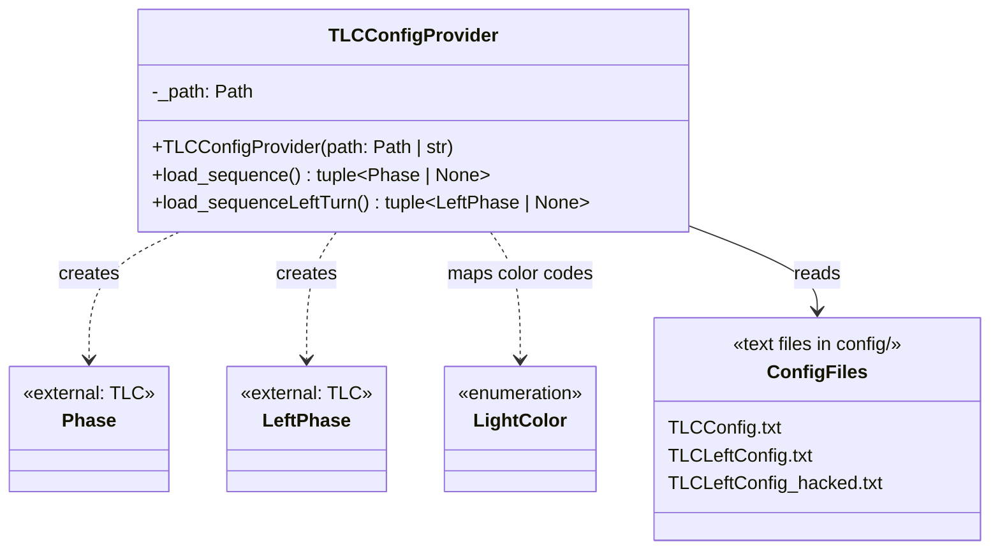

# TLC Config Provider Class Diagram

```mermaid
classDiagram
    class TLCConfigProvider {
        -_path: Path
        +TLCConfigProvider(path: Path | str)
        +load_sequence() tuple~Phase | None~
        +load_sequenceLeftTurn() tuple~LeftPhase | None~
    }

    class Phase {
        <<external: TLC>>
    }

    class LeftPhase {
        <<external: TLC>>
    }

    class LightColor {
        <<enumeration>>
    }

    class ConfigFiles {
        <<text files in config/>>
        TLCConfig.txt
        TLCLeftConfig.txt
        TLCLeftConfig_hacked.txt
    }

    TLCConfigProvider ..> Phase : creates
    TLCConfigProvider ..> LeftPhase : creates
    TLCConfigProvider ..> LightColor : maps color codes
    TLCConfigProvider --> ConfigFiles : reads
```

`Phase` and `LeftPhase` are imported from `TLC.py`; `LightColor` is imported
from `TrafficLight.py`. Both load methods read the file passed to the constructor.
