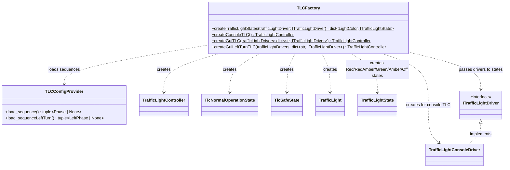

# TLC Factory Class Diagram

```mermaid
classDiagram
    class TLCFactory {
        +createTrafficLightStates(trafficLightDriver: ITrafficLightDriver)$ dict~LightColor, ITrafficLightState~
        +createConsoleTLC()$ TrafficLightController
        +createGuiTLC(trafficLightDrivers: dict~str, ITrafficLightDriver~)$ TrafficLightController
        +createGuiLeftTurnTLC(trafficLightDrivers: dict~str, ITrafficLightDriver~)$ TrafficLightController
    }

    class TLCConfigProvider {
        +load_sequence() tuple~Phase | None~
        +load_sequenceLeftTurn() tuple~LeftPhase | None~
    }

    class TrafficLightController
    class TlcNormalOperationState
    class TlcSafeState
    class TrafficLight
    class TrafficLightState
    class ITrafficLightDriver {
        <<interface>>
    }
    class TrafficLightConsoleDriver

    TLCFactory ..> TLCConfigProvider : loads sequences
    TLCFactory ..> TrafficLightController : creates
    TLCFactory ..> TlcNormalOperationState : creates
    TLCFactory ..> TlcSafeState : creates
    TLCFactory ..> TrafficLight : creates
    TLCFactory ..> TrafficLightState : creates Red/RedAmber/Green/Amber/Off states
    TLCFactory ..> ITrafficLightDriver : passes drivers to states
    TLCFactory ..> TrafficLightConsoleDriver : creates for console TLC
    ITrafficLightDriver <|.. TrafficLightConsoleDriver : implements
```

The diagram focuses on the types used directly by the factory methods;
configuration file paths and sequence values are omitted.
