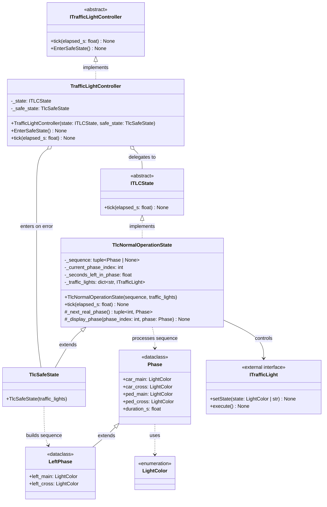

# TLC Class Diagram

```mermaid
classDiagram
    class Phase {
        <<dataclass>>
        +car_main: LightColor
        +car_cross: LightColor
        +ped_main: LightColor
        +ped_cross: LightColor
        +duration_s: float
    }

    class LeftPhase {
        <<dataclass>>
        +left_main: LightColor
        +left_cross: LightColor
    }

    class ITLCState {
        <<abstract>>
        +tick(elapsed_s: float) None
    }

    class ITrafficLightController {
        <<abstract>>
        +tick(elapsed_s: float) None
        +EnterSafeState() None
    }

    class TlcNormalOperationState {
        -_sequence: tuple~Phase | None~
        -_current_phase_index: int
        -_seconds_left_in_phase: float
        -_traffic_lights: dict~str, ITrafficLight~
        +TlcNormalOperationState(sequence, traffic_lights)
        +tick(elapsed_s: float) None
        #_next_real_phase() tuple~int, Phase~
        #_display_phase(phase_index: int, phase: Phase) None
    }

    class TlcSafeState {
        +TlcSafeState(traffic_lights)
    }

    class TrafficLightController {
        -_state: ITLCState
        -_safe_state: TlcSafeState
        +TrafficLightController(state: ITLCState, safe_state: TlcSafeState)
        +EnterSafeState() None
        +tick(elapsed_s: float) None
    }

    class LightColor {
        <<enumeration>>
    }

    class ITrafficLight {
        <<external interface>>
        +setState(state: LightColor | str) None
        +execute() None
    }

    Phase <|-- LeftPhase : extends
    ITLCState <|.. TlcNormalOperationState : implements
    TlcNormalOperationState <|-- TlcSafeState : extends
    TlcSafeState ..> LeftPhase : builds sequence
    ITrafficLightController <|.. TrafficLightController : implements
    TrafficLightController o-- ITLCState : delegates to
    TrafficLightController o-- TlcSafeState : enters on error
    TlcNormalOperationState ..> Phase : processes sequence
    Phase ..> LightColor : uses
    TlcNormalOperationState --> ITrafficLight : controls
```

`LightColor` and `ITrafficLight` are imported from `TrafficLight.py`.
