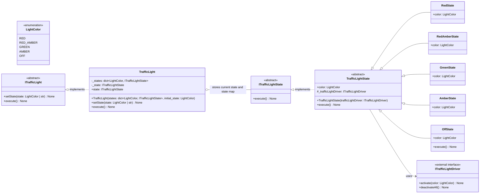

# Traffic Light Class Diagram

```mermaid
classDiagram
    direction LR

    class RedState {
        +color: LightColor
    }
    class RedAmberState {
        +color: LightColor
    }
    class GreenState {
        +color: LightColor
    }
    class AmberState {
        +color: LightColor
    }
    class OffState {
        +color: LightColor
        +execute() None
    }

    class LightColor {
        <<enumeration>>
        RED
        RED_AMBER
        GREEN
        AMBER
        OFF
    }

    class ITrafficLightState {
        <<abstract>>
        +execute() None
    }

    class TrafficLightState {
        <<abstract>>
        +color: LightColor
        #_trafficLightDriver: ITrafficLightDriver
        +TrafficLightState(trafficLightDriver: ITrafficLightDriver)
        +execute() None
    }

    class ITrafficLight {
        <<abstract>>
        +setState(state: LightColor | str) None
        +execute() None
    }

    class TrafficLight {
        -_states: dict~LightColor, ITrafficLightState~
        -_state: ITrafficLightState
        +TrafficLight(states: dict~LightColor, ITrafficLightState~, initial_state: LightColor)
        +state: ITrafficLightState
        +setState(state: LightColor | str) None
        +execute() None
    }

    class ITrafficLightDriver {
        <<external interface>>
        +activate(color: LightColor) None
        +deactivateAll() None
    }

    ITrafficLightState <|.. TrafficLightState : implements
    TrafficLightState <|-- RedState
    TrafficLightState <|-- RedAmberState
    TrafficLightState <|-- GreenState
    TrafficLightState <|-- AmberState
    TrafficLightState <|-- OffState

    ITrafficLight <|.. TrafficLight : implements
    TrafficLight o-- ITrafficLightState : stores current state and state map
    TrafficLightState --> ITrafficLightDriver : uses
```

`ITrafficLightDriver` is imported only for type checking from
`TrafficLightAbstraction.py`.
